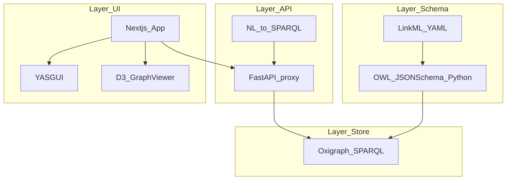
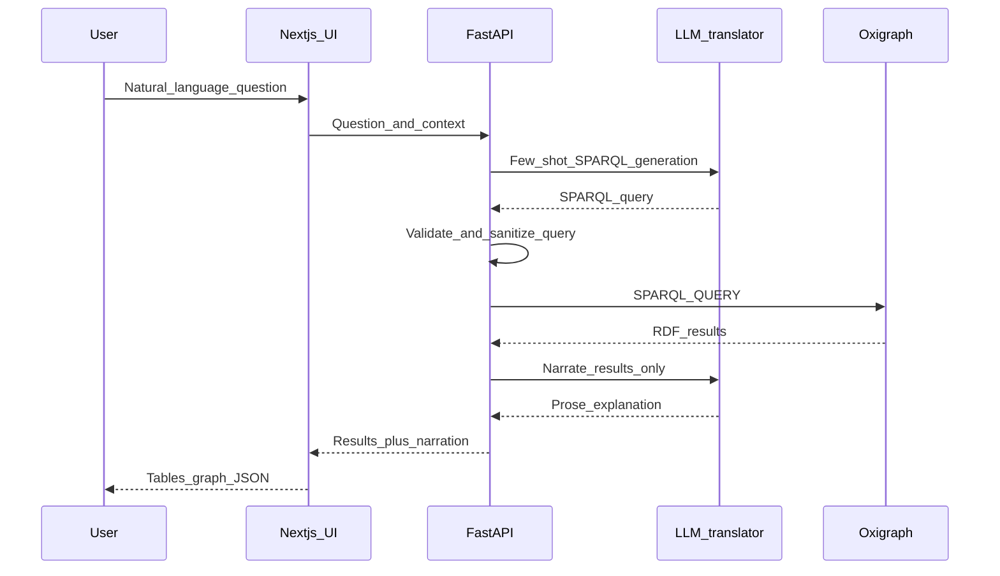

# ShakespeareCRM

**A living knowledge graph of Shakespeare’s world** — v0.1

ShakespeareCRM is a queryable, explorable, semantically rich knowledge system that models William Shakespeare’s body of work (plays, poems, characters, performances, manuscripts, adaptations) as **cultural heritage objects** using **CIDOC-CRM**, with **LinkML** as the schema source of truth, **Oxigraph** as the triple store, **YASGUI** for SPARQL exploration, and **WIDoC** for ontology documentation.

> **Status:** Oxigraph, ingestion, and Gradio SPARQL UI are wired for local Phase 0 use. FastAPI / Next.js layers are still roadmap items.

## Elevator pitch

Ask questions like *“Show every betrayal involving royalty across all tragedies”* and get back **graph-shaped answers** — navigable entities and events — not a pile of text snippets. The LLM **translates** natural language to SPARQL and **narrates** results; it does **not** invent facts (see [docs/VISION.md](docs/VISION.md)).

## Architecture

### Four layers



### Natural-language query flow (Phase 2+)



## Stack

| Tool | Role | Rationale |
|------|------|-----------|
| CIDOC-CRM | Domain ontology | Event-centric cultural heritage semantics |
| LinkML | Schema definition | YAML-first SoT; generates OWL, JSON Schema, Python |
| Oxigraph | RDF store | SPARQL 1.1; single binary / deployable |
| YASGUI | SPARQL UI | Browser editor, results, community standard |
| WIDoC | Ontology docs | HTML from OWL; stays aligned with schema |

## Repository map

| Path | Purpose |
|------|---------|
| [schemas/](schemas/) | LinkML definitions (edit here only) |
| [ontology/](ontology/) | Generated OWL/Turtle — **do not hand-edit** |
| [data/](data/) | Raw sources, triples, ingestion scripts |
| [docs/](docs/) | Vision, ontology notes, roadmap, deep-dives |
| [api/](api/) | FastAPI SPARQL proxy, NL-to-SPARQL (Phase 2+) |
| [frontend/](frontend/) | Next.js 15 App Router, YASGUI, D3 (Phase 2–3+) |
| [docker/](docker/) | Compose services for Oxigraph and WIDoC |
| [scripts/](scripts/) | Generate schema, load data, docs |
| [tests/](tests/) | SPARQL and ontology tests |

Agents: start with [AGENTS.md](AGENTS.md).

## Quick start (local stack)

1. Clone the repository and open the project root.
2. Start **Oxigraph**: `docker compose -f docker/docker-compose.yml up oxigraph` → SPARQL at [http://localhost:7878/](http://localhost:7878/) (see [docker/oxigraph/README.md](docker/oxigraph/README.md)).
3. Generate ontology Turtle: `uv run generate-ontology`.
4. Load TBox + Hamlet seed ABox: `uv run shakespeare-oxigraph-load` (or `uv run python data/ingest/hamlet.py`).
5. **Gradio** (optional): `uv sync --group ui` then `uv run shakespeare-sparql-ui` → default [http://127.0.0.1:7860](http://127.0.0.1:7860).
6. **WIDoC** (ontology HTML): `docker compose -f docker/docker-compose.yml --profile docs up widoco` → [http://localhost:8080/](http://localhost:8080/). For the Alpine placeholder only: `--profile scaffold up`.
7. Example SPARQL patterns: [docs/example_queries.sparql](docs/example_queries.sparql).

**First query to try** (prefixes must match your deployed ontology — adjust after LinkML generation):

```sparql
# Example pattern — finalize crm: and : prefixes after ontology import
SELECT ?char ?event WHERE {
  ?event a crm:E5_Event ;
         crm:P11_had_participant ?char ;
         crm:P2_has_type ?:betrayal .
}
```

## Prerequisites

- Docker and Docker Compose (Oxigraph, WIDoC)
- Python 3.11+ with `linkml`, `rdflib`, `requests` (ingestion and codegen)
- Node.js 20+ (Next.js frontend)
- OpenAI API key (Phase 2+, NL-to-SPARQL)

## Data sources

- [Folger Shakespeare Library TEI XML](https://shakespeare.folger.edu) — canonical structured text (CC BY-SA; verify current terms)
- [Wikidata](https://query.wikidata.org/) — federation / enrichment (Phase 1+)
- Internet Shakespeare Editions; British Library manuscript records — see [docs/PUBLISHING.md](docs/PUBLISHING.md)

## Deep dive

- [docs/VISION.md](docs/VISION.md) — vision, features, LLM grounding rule  
- [docs/ONTOLOGY.md](docs/ONTOLOGY.md) — CIDOC-CRM mapping, LinkML strategy  
- [docs/ARCHITECTURE.md](docs/ARCHITECTURE.md) — layers and flows  
- [docs/ROADMAP.md](docs/ROADMAP.md) — phases 0–4  
- [docs/PITFALLS.md](docs/PITFALLS.md) — known hard problems  
- [docs/PUBLISHING.md](docs/PUBLISHING.md) — datasets, venues, demo bar  

## Citation

If you use ShakespeareCRM, cite the repository and any Zenodo DOI attached to released datasets (see [docs/PUBLISHING.md](docs/PUBLISHING.md)).

---

*ShakespeareCRM · v0.1*
