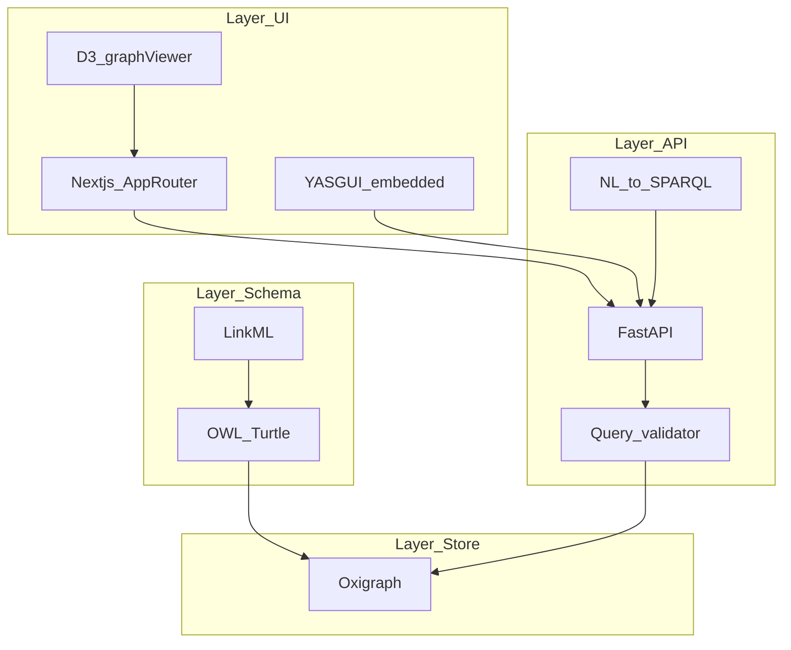
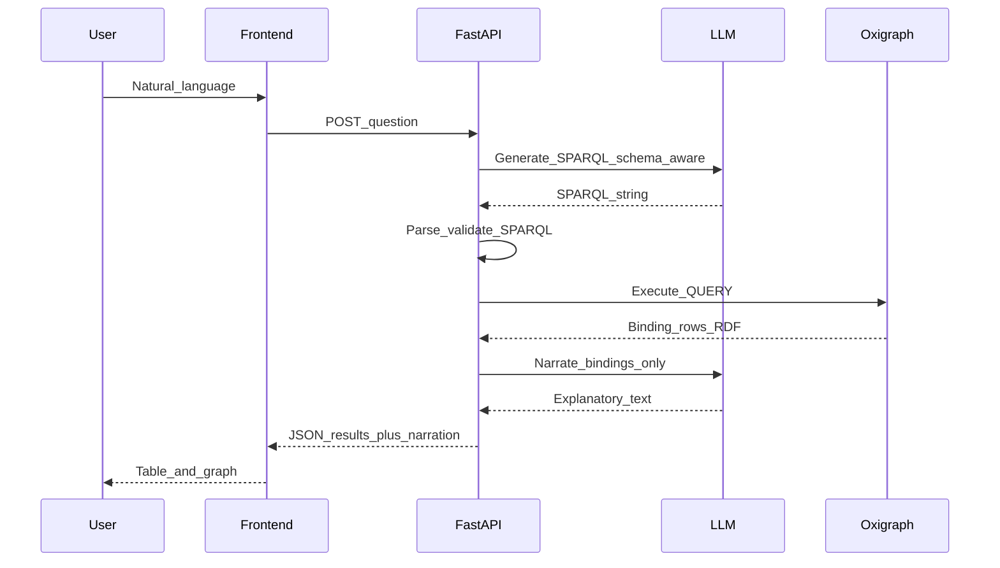

# System architecture

The system has four layers. Each layer has one job; interfaces stay explicit and minimal.

| Layer | Components | Responsibility |
|-------|-------------|----------------|
| **UI** | Next.js 15 App Router, YASGUI, D3.js | NL query box, SPARQL editor, graph canvas, motif explorer, adaptation timeline |
| **API** | FastAPI, NL-to-SPARQL | SPARQL proxy (CORS, auth), translation, narration, validation, read-only public policy |
| **Store** | Oxigraph | SPARQL 1.1; named graphs for ontology / data / inference; persistence; optional `SERVICE` federation |
| **Schema** | LinkML → OWL, JSON Schema, Python | Single SoT; CIDOC-CRM alignment + Shakespeare extensions; WIDoC consumes OWL |

## Layer diagram

## Natural language query sequence

## Named graphs

From Phase 0 onward, **separate**:

- Ontology graph (TBox / CRM alignment)  
- Instance data graph(s) (ABox)  
- Inferred material (if materialized) — optional graph

Exact IRIs should be documented in the schema repo and repeated in ingestion scripts so queries can use `GRAPH` clauses for provenance and partial updates.

## External services

- **Wikidata** and other SPARQL endpoints via `SERVICE` where appropriate (Phase 1+), with clear timeouts and caching policy later if needed.

---

*Roadmap: [ROADMAP.md](ROADMAP.md). Agent constraints: [AGENTS.md](../AGENTS.md).*
