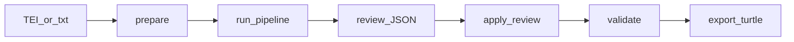

# Agentic KG curation pipeline

End-to-end **assisted** curation: dramatic text → structured draft (JSON) → human review → validated **Turtle** for instance named graphs. Aligned with [STRUCTSENSE_ADAPTATION.md](STRUCTSENSE_ADAPTATION.md) and [AGENTS.md](../AGENTS.md).

## Prerequisites

- Python **≥ 3.11**, [`uv`](https://docs.astral.sh/uv/) recommended.
- **spaCy** (optional, recommended on **Python 3.11–3.13**): finer sentence boundaries than the built-in heuristic.

```bash
cd /path/to/shakespeare
uv sync --group curation-nlp
uv run python -m spacy download en_core_web_sm
```

Without this group, `shakespeare-curate prepare` uses a lightweight fallback splitter (no extra install). The `--spacy` flag requires the optional group.

- (Optional) **Oxigraph** or any SPARQL 1.1 endpoint for live alignment queries. Local URL is up to your compose/stack; the CLI defaults to `SPARQL_ENDPOINT` below.

- (Optional) **LLM** access for real extraction/judging. Without keys, use **`--mock`** for deterministic stub output suitable for CI and offline development.

## Environment variables

| Variable | Purpose | Default |
|----------|---------|---------|
| `SPARQL_ENDPOINT` | Read-only SPARQL query URL | `http://localhost:7878/query` |
| `OPENAI_API_KEY` | OpenAI-compatible API for Pydantic AI | unset |
| `CURATION_LLM_MODEL` | Model string, e.g. `openai:gpt-4o-mini` | `openai:gpt-4o-mini` |

Other providers work if configured per [Pydantic AI model docs](https://ai.pydantic.dev/models/) (e.g. `anthropic:…`, `google-gla:…`).

## Named graph IRIs (convention)

Until Phase 0 locks these in schema docs, the emitter uses:

- **Instances (ABox):** `https://w3id.org/shakespeare-crm/graph/instances`
- **Ontology (TBox):** `https://w3id.org/shakespeare-crm/graph/ontology`

Override with `--graph-instances` on `export-turtle` if your Oxigraph load uses different IRIs.

## Workflow

1. **Prepare** text: TEI XML or plain `.txt` → JSON with stable **span IDs** and optional spaCy sentence boundaries.
2. **Run** extractor → alignment → judge (or `--mock` stubs).
3. **Review** the draft JSON; set `review.human_decisions[].status` to `approve` / `reject` / `needs_edit`, add `entity_overrides` if needed (see [HIL review format](#hil-review-format)).
4. **Validate** merged draft against Pydantic / optional LinkML-generated JSON Schema.
5. **Export** Turtle and load into Oxigraph (operator script / `data/ingest/` — not exposed as a public browser UPDATE).



## CLI reference

All commands assume repository root.

```bash
# 1) Segment input into passages + sentences (spaCy)
uv run shakespeare-curate prepare path/to/passage.xml -o build/spans.json

# 2) Run agents (use --mock without API keys)
uv run shakespeare-curate run build/spans.json --task-pack src/shakespeare_tools/curation/examples/hamlet_task_pack.yaml -o build/draft.json --mock

# 3) After editing review section of draft (or separate review file):
uv run shakespeare-curate apply-review build/draft.json -o build/draft.applied.json

# 4) Validate draft (strict)
uv run shakespeare-curate validate build/draft.applied.json

# 5) Emit Turtle
uv run shakespeare-curate export-turtle build/draft.applied.json -o data/triples/hamlet_curated.ttl
```

### `prepare`

- Accepts `.xml` (TEI-like: uses `<div>`, `<sp>`, or root text) or `.txt`.
- Outputs JSON: `passage_id`, `text`, `char_start`/`char_end`, `sentences[]` with `span_id`.

### `run`

- Loads a **task pack** YAML (play slug, work id, instructions).
- Writes **`CurationDraftBundle`**: extractions, alignments, judge rows, and a **`review`** stub.

### `apply-review`

- Merges `human_decisions` / `entity_overrides` from the draft’s `review` object into `aligned_entities` / **`approved_triples`**.
- Idempotent on already-approved rows.

### `validate`

- Ensures merged draft is internally consistent and that approved triples reference known `span_id`s.

### `export-turtle`

- Serializes **approved** `DramaticEvent` (and linked entities) to Turtle with **deterministic** `sc:` URIs.

## HIL review format

Embedded in the draft JSON under **`review`** (editable by hand or tooling):

```json
{
  "review": {
    "reviewer": "optional name",
    "human_decisions": [
      {
        "candidate_id": "evt-001",
        "status": "approve",
        "comment": ""
      }
    ],
    "entity_overrides": [
      {
        "mention": "Hamlet",
        "resolved_id": "sc:hamlet-character",
        "note": "fictional prince, not the play"
      }
    ]
  }
}
```

`status` is one of: **`approve`**, **`reject`**, **`needs_edit`**.

`entity_overrides` apply after automated alignment for the next `apply-review` / export pass.

For AIProofBuddy-style benchmarking, store sidecar files:

```json
{
  "run_id": "2026-05-04T12:00:00",
  "flags": [
    {"field": "motif_type", "verdict": "correct", "candidate_id": "evt-001"}
  ]
}
```

## LinkML JSON Schema (optional strict validation)

Generate from the schema (artifact typically gitignored under `ontology/`):

```bash
uv run gen-json-schema schemas/shakespeare_crm.yaml -o ontology/shakespeare_crm.schema.json
```

The Python validator primarily uses **Pydantic** models derived from the same slots; full JSON Schema file validation can be extended to load the generated file if present.

## Connecting to `data/ingest/hamlet.py`

Phase 0 ingest should treat files under `data/triples/` as **build outputs**. After `export-turtle`, load `hamlet_curated.ttl` into the **instances** named graph via your Oxigraph loader (HTTP PUT, `sparql-load`, or compose volume) — implement the actual load in `data/ingest/hamlet.py` when Phase 0 lands.

## Troubleshooting

- **`spacy`-missing model:** run `uv run python -m spacy download en_core_web_sm`.
- **Empty alignment:** run `generate-ontology` and point **`--ontology-ttl`** at `ontology/shakespeare_crm.ttl` for local label search, or load TBox into Oxigraph and set `SPARQL_ENDPOINT`.
- **LLM errors:** use `--mock` to verify the non-LLM path; check `CURATION_LLM_MODEL` and provider keys.
